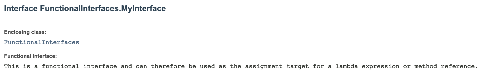

# Modern-Java-Recipes
Documenting all "recipes" described in Modern Java Recipes by Ken Kousen. The documentation is done as JavaDoc.

## Generate the Javadoc
In the root of the project run:
    javadoc -d doc src/*/*
The depth of the hierarchy needs to be taken into consideration when generating the Javadoc files.

## < and > characters
&#60 ; and &#62 ;

## Referencing methods from current class
For referencing a method from the current class you could use {@link #anonymousInnerClassForRunnable()} and not
{@link LambdaExpression#anonymousInnerClassForRunnable()}

## Add description to the package
In the package for which a description is needed implement package-info.java file.
Multiple lines can be written but the code will be displayed until the first period.
Link: https://docs.oracle.com/javase/6/docs/technotes/tools/solaris/javadoc.html#packagecomment

## Add images
A directory named "doc-files" needs to exist and to include the images. I think this directory should be in src/, under
the package, but for me it worked only having it in the root of the project and then adding the image to my Javadoc like this:
    
Otherwise the next error is received:
    Loading source file src/chapter_1_The_Basics/StaticMethodsInInterfaces.java...
    javadoc: error - Illegal package name: "src/chapter_1_The_Basics/doc-files"

Link: https://docs.oracle.com/javase/6/docs/technotes/tools/solaris/javadoc.html#unprocessed

-docfilessubdirs
    Enables deep copying of "doc-files" directories. In other words, subdirectories and all contents are recursively copied to the destination. For example, the directory doc-files/example/images and all its contents would now be copied. There is also an option to exclude subdirectories.

-excludedocfilessubdir  name1:name2...
    Excludes any "doc-files" subdirectories with the given names. This prevents the copying of SCCS and other source-code-control subdirectories.
!!! Run:
    javadoc -d doc -docfilessubdirs src/*/*

## Links
- https://www.baeldung.com/javadoc
- https://reflectoring.io/howto-format-code-snippets-in-javadoc/
- https://www.w3schools.com/tags/ref_byfunc.asp
- https://www.degraeve.com/reference/specialcharacters.php
- https://www.html.am/html-codes/character-codes/html-tab-code.cfm
